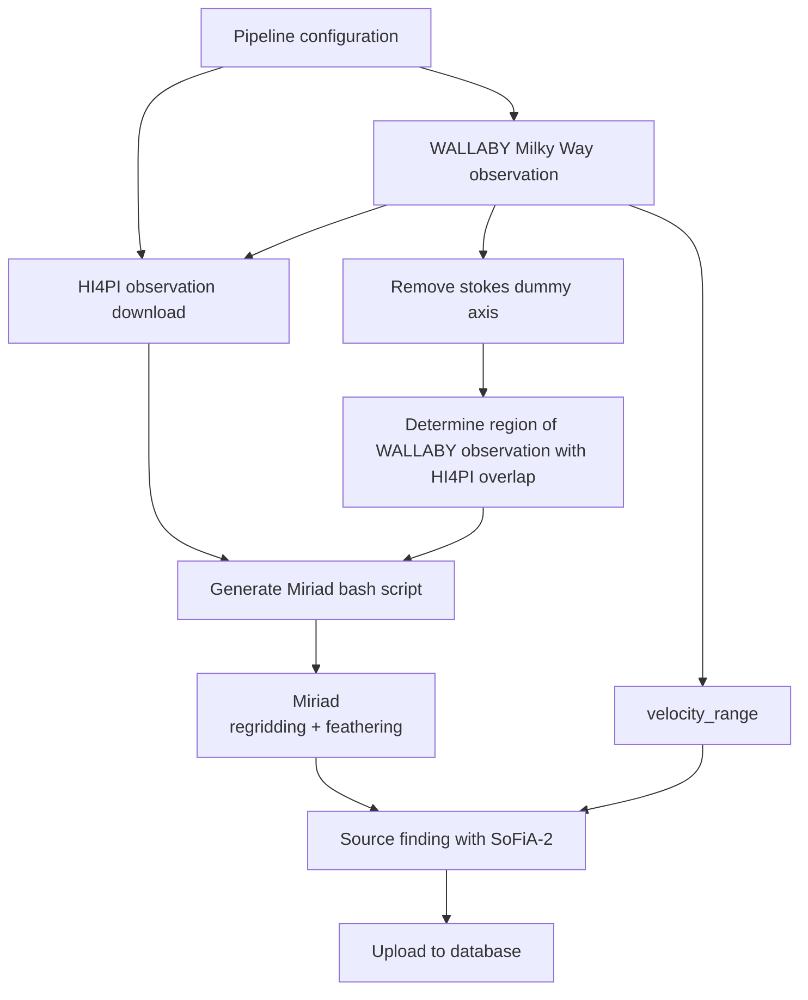

# WALLABY Milky Way

A Python (Prefect) pipeline for combining WALLABY Milky Way observations with Parkes HI4PI single dish observations, and performing source finding, for generating a source catalog of Milky Way data products. This has been written to run on the [CANFAR science platform](https://www.canfar.net/science-portal/).

## Overview

### Steps

1. Install local dependencies (`pip install -r requirements.txt`)
2. Authenticate with CANFAR (`cadc-get-cert -u <username>`)
3. Build Docker images
4. Upload Docker images
5. Run Prefect server
6. Run WALLABY MW pipeline

### Pipeline

Details in the source code: [`pipeline.py`](pipeline.py)



## Docker images

1. Build docker images locally (e.g. to `images.canfar.net/srcnet/wallaby-mw-preprocess`)
2. Upload to Harbour registry (see [link](https://www.opencadc.org/science-containers/complete/publishing/#publishing-skaha-containers))
3. Label images as headless (required for headless deployment via the SKAHA API, [link](https://images.canfar.net/harbor/projects/))

## Build

```
docker build --platform linux/amd64 -t <image_name> <folder>
```

### Config

Update the [configuration file](./pipeline.ini) template provided in the repository.

| Parameter | Section | Description |
| --- | --- | --- |
| workdir | default | Local working directory |
| TBA |  |  |
