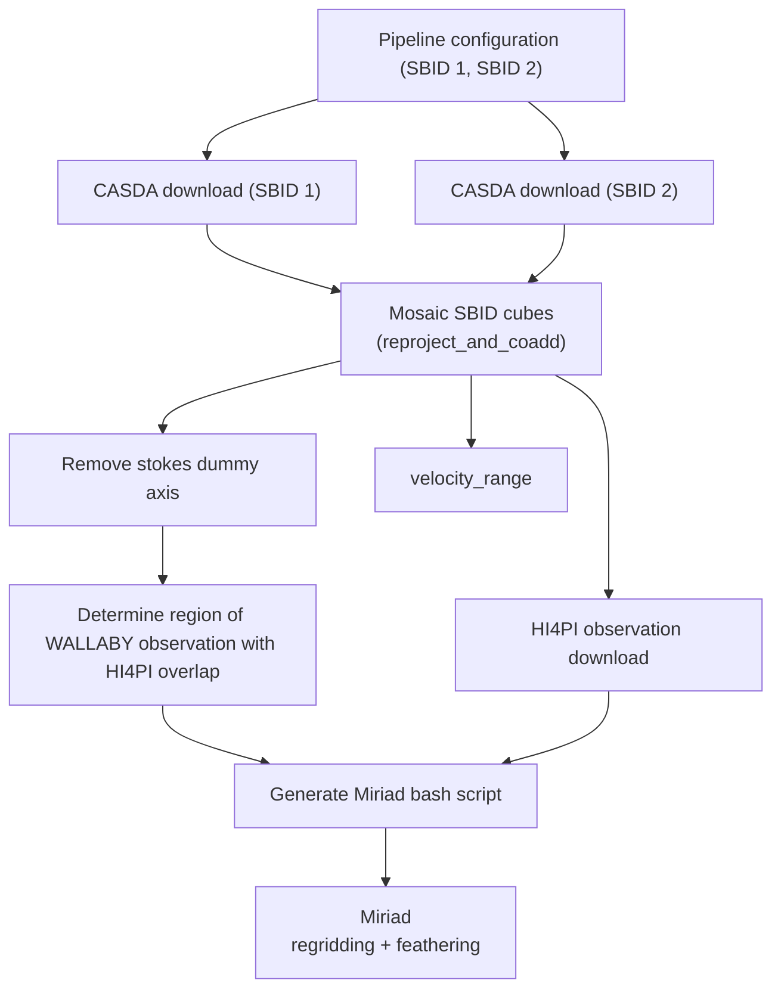
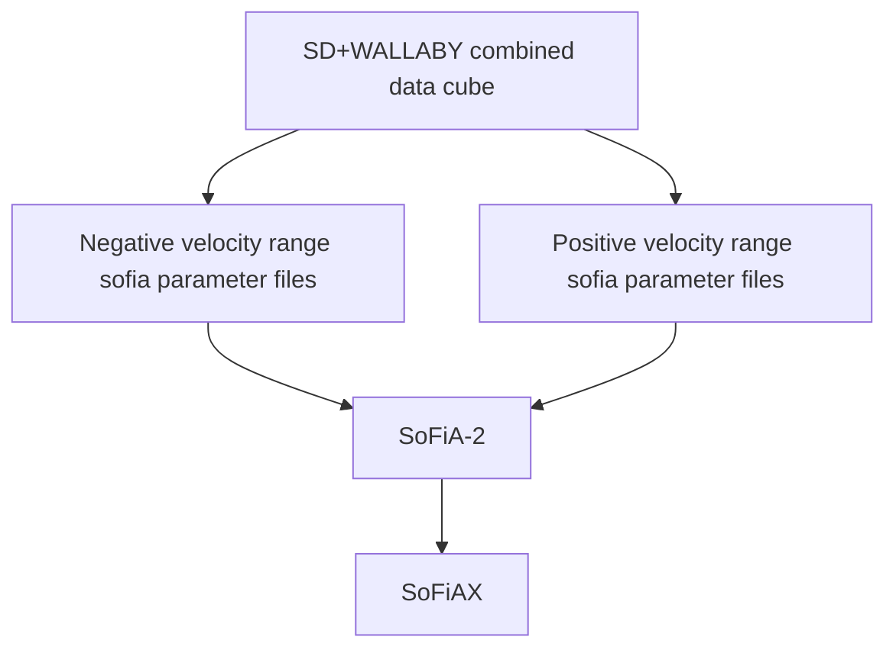

# WALLABY Milky Way

A Python (Prefect) pipeline for combining WALLABY Milky Way observations with Parkes HI4PI single dish observations, and performing source finding, for generating a source catalog of Milky Way data products. This has been written to run on the [CANFAR science platform](https://www.canfar.net/science-portal/).

## Overview

### Steps

1. Install local dependencies (`pip install -r requirements.txt`)
2. Authenticate with CANFAR (`cadc-get-cert -u <username>`)
3. Build Docker images
4. Upload Docker images
5. Run Prefect server
6. Run WALLABY MW pipeline

### Combine Pipeline

Performs single dish and interferometer combination with all of the relevant pre-processing. Details in the source code: [`combine.py`](combine.py)


```mermaid

flowchart TD
    config["Pipeline configuration (SBID 1, SBID 2)"]
    casda1["CASDA download (SBID 1)"]
    casda2["CASDA download (SBID 2)"]
    mosaic["Mosaic SBID cubes
     (reproject_and_coadd)"]
    hi4pi["HI4PI observation download"]
    subfits["Remove stokes dummy axis"]
    region["Determine region of WALLABY observation with HI4PI overlap"]
    miriad_script["Generate Miriad bash script"]
    miriad["Miriad
     regridding + feathering"]

    config --> casda1
    config --> casda2
    casda1 --> mosaic
    casda2 --> mosaic
    mosaic --> hi4pi
    mosaic --> subfits
    subfits --> region
    region --> miriad_script
    hi4pi --> miriad_script
    miriad_script --> miriad
    mosaic --> velocity_range
```

WALLABY fields are released to CASDA as two ASKAP SBIDs. `combine.py` downloads
each SBID's Milky Way spectral cube from CASDA (`astroquery`, requires
`CASDA_USERNAME`/`CASDA_PASSWORD`), mosaics them into a single WALLABY image
(pure-Python `reproject` package, an alternative to askapsoft linmos), then
continues into the existing HI4PI + Miriad combination steps unchanged.

### Source finding

A simple pipeline to perform source finding on the output combined data cube. Splits the source finding into positive and negative velocities. Details in the source code: [`source_finding.py`](source_finding.py)


```mermaid

flowchart TD
    combined["SD+WALLABY combined data cube"]
    pos["Positive velocity range sofia parameter files"]
    neg["Negative velocity range sofia parameter files"]
    sofia["SoFiA-2"]
    sofiax["SoFiAX"]

    combined --> pos
    combined --> neg
    neg --> sofia
    pos --> sofia
    sofia --> sofiax
```

## Docker images

1. Build docker images locally (e.g. to `images.canfar.net/srcnet/wallaby-mw-preprocess`)
2. Upload to Harbour registry (see [link](https://www.opencadc.org/science-containers/complete/publishing/#publishing-skaha-containers))
3. Label images as headless (required for headless deployment via the SKAHA API, [link](https://images.canfar.net/harbor/projects/))

## Build

```
docker build --platform linux/amd64 -t <image_name> <folder>
```

### Config

Update the [configuration file](./pipeline.ini) template provided in the repository.

| Parameter | Section | Description |
| --- | --- | --- |
| workdir | default | Local working directory |
| TBA |  |  |
